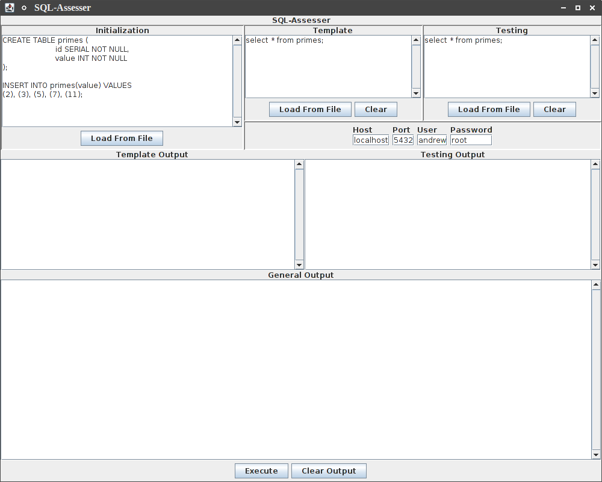

# SQL-Assesser
A tool to help in assessing student-submitted SQL.

## Instructions for Use
To use this tool to assess and compare SQL, please ensure the following prerequisites are met:

* A PostgreSQL database server is currently running (which you have full `CREATEDB` permissions to).
* You know the hostname, port, username, and password which are needed to connect to this database.

The aforementioned information can be entered into the relevant fields in the user interface as shown in the image. Once this is done, you may begin comparing SQL. To do this, do the following:

1. Load any initialization statements into the box titled `Initialization`. Anything in this box will be executed on both databases to prepare them for the assessment.
2. Load the template statements (the answers, or confirmed correct statements) into the box titled `Template`. These will be executed on only one of the databases.
3. Load the testing statements (things you want to test for correctness) into the box titled `Testing`. These will be executed on the other database.
4. Click `Execute` to begin the assessment process. It is as follows:
	1. Delete and create two new empty testing databases.
	2. Run the `Initialization` code on both databases.
	3. Run the `Template` code on one database.
	4. Run the `Testing` code on the other database.
	5. Output the result of each SQL statement, plus an evaluation of the result of `Testing` when compared with `Template`. This is `true` if the same schema update and data manipulation statements were used, as well as the same result sets from select queries.

## Notes
There are cases where the assesser will return a false negative (i.e. false even though the SQL works) because of the improbability of validating the order and content of statements other than `SELECT`.
	
If you think you can figure out how to account for things such as out-of-order insertions, updates, and deletions, and drawing transaction boundaries around related sets of statements that have common pre- and post-conditions, feel free to create a pull-request with the changes.